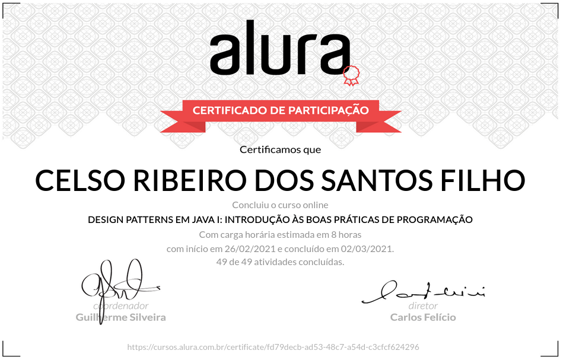

# Design Patterns em Java I: Introdução às boas práticas de programação
  
+ Não repita código com Template Method
+ Saiba da importância de estudar os padrões de projeto
+ Resolva problemas de muito ifs usando Strategy
+ Adicione comportamentos ao seu objeto com Decorator
+ Crie diferentes ações com Observer
+ Use o Builder para a criação de objetos complicados

## Aulas

+ Strategy

      Apresentação
      Criando o projeto
      Calculando impostos
      Aplicando o pattern Strategy
      Propósito do pattern Strategy
      Para saber mais: Strategy

+ Chain of Responsibility 

      Calculando descontos
      Tentando utilizar o pattern Strategy
      Muitos ifs
      Aplicando o pattern Chain of Responsibility
      Entendendo o pattern Chain of Responsibility
      Para saber mais: Chain of Responsibility

+ Template Method

      Aplicando o pattern Template Method
      Pattern Template Method
      Entendendo o pattern Template Method
      Para saber mais: Template Method

+ State

      Gerando um pedido
      Aplicando o pattern Command
      Problemas com o código
      Command Handlers
      Para saber mais: Command

+ Command

      Criando abstrações com interfaces e polimorfismo
      Dependency Inversion Principle
      Vantagem ao criar dependências com interfaces
      Interface Segregation Principle
      Definição do ISP
      Projeto final do curso
      Conclusão

+ Observer

      Ações após gerar um pedido
      Muitas responsabilidades
      Aplicando o pattern Observer
      Para saber mais: Observer
      Faça como eu fiz
      Projeto do curso
      O que aprendemos?
      Conclusão

<!-- # Certificado de conclusão

https://cursos.alura.com.br/certificate/9f6eb204-4029-4052-a585-a2b8783dbab3

 -->