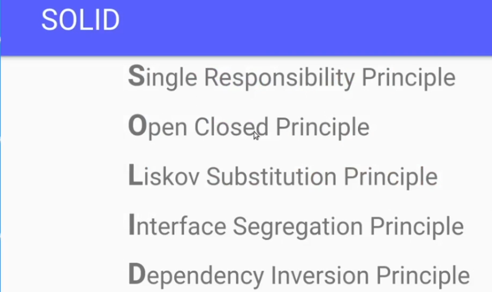
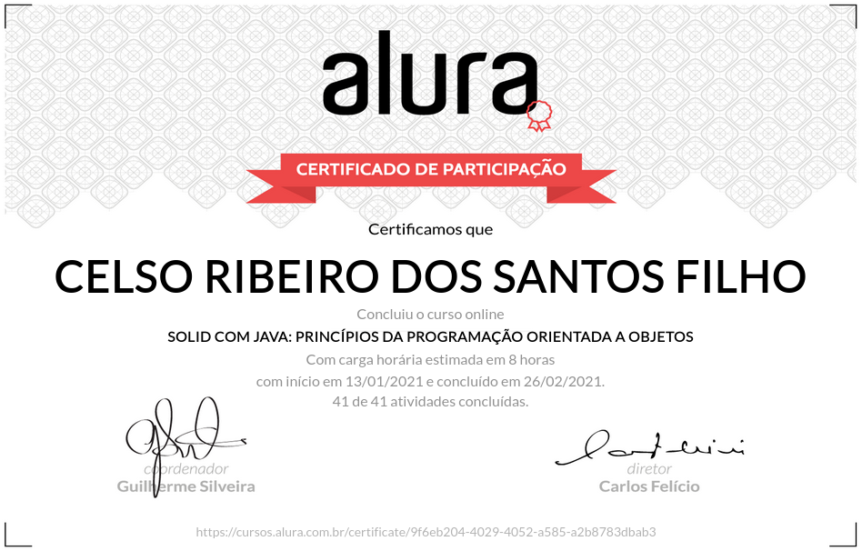

# SOLID com Java: Princípios da programação orientada a objetos

                                                            |  
:----------------------------------------------------------:|:-------------------------:
+ Aprenda conceitos avançados de orientação a objetos       |    
+ Escreva código coeso com Single Responsibility Principle  |
+ Saiba como lidar com acoplamento                          |
+ Entenda a fundo os ganhos do encapsulamento               |
+ Domine os princípios de código sólido                     |
+ Veja técnicas e exemplos em Java                          |

## Aulas

+ Orientação a Objetos

      Apresentação
      Projeto inicial do treinamento
      Coesão
      Classes coesas
      Encapsulamento
      Protegendo o código
      Acoplamento
      Dependências no código

+ Melhorando a coesão

      Extraindo a lógica de reajuste salarial
      Extraindo classe
      Single Responsibility Principle
      Definição de SRP

+ Reduzindo o acoplamento

      Extraindo validações
      Muitas validações
      Open Closed Principle
      Garantindo que o sistema seja extensível

+ Herança indesejada

      Implementando uma nova regra de negócio
      Utilizando herança da maneira errada
      Herança
      Liskov Substitution Principle
      Alternativa à herança

+ Trabalhando com abstrações

      Criando abstrações com interfaces e polimorfismo
      Dependency Inversion Principle
      Vantagem ao criar dependências com interfaces
      Interface Segregation Principle
      Definição do ISP
      Projeto final do curso
      Conclusão

# Certificado de conclusão

https://cursos.alura.com.br/certificate/9f6eb204-4029-4052-a585-a2b8783dbab3

